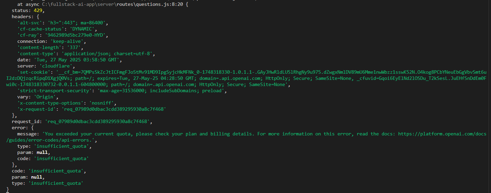

# 🧠 Fullstack AI Interview Q&A App

This is a full-stack web application that uses **OpenAI’s GPT model** to dynamically generate **interview questions, answers, and step-by-step explanations** based on user-inputted topics and difficulty levels.

## 📌 Use Case

This app helps users (students, job-seekers, interviewees) prepare for technical interviews by:
- Allowing them to input any topic and difficulty level.
- Getting AI-generated questions and explanations.
- Instantly viewing answers and learning from them.

## 🧠 Project Planning Steps

1. **Define the Goal**: Create a tool that generates and explains interview questions using OpenAI.
2. **Tech Stack Selection**: Chose React for frontend and Node.js with Express for backend.
3. **OpenAI Integration**: Integrated OpenAI API to fetch AI-generated content.
4. **Frontend Design**: Created forms and views for user inputs and displaying results.
5. **Backend Setup**: Set up API routes, environment config, and OpenAI service integration.
6. **Testing & Debugging**: Handled API limits, environment issues, and response parsing.

## 🏗️ Tech Stack

- **Frontend**: React, Axios
- **Backend**: Node.js, Express.js, dotenv
- **AI Service**: OpenAI API (GPT-4 / GPT-3.5-turbo)
- **Development Tools**: nodemon, concurrently

## 📁 Folder Structure

```
fullstack-ai-qa-app/
├── client/          # React frontend
│   └── src/
│       └── components/
├── server/          # Node.js backend
│   ├── routes/
│   └── services/
└── README.md
```

## 📦 Dependencies

### Backend
- axios
- express
- cors
- dotenv
- openai
- nodemon


### Frontend
- react
- axios

## ⚙️ How to Run

### 1. Clone the Repository

```bash
git clone https://github.com/Govindrajewar/fullstack-ai-app.git
cd fullstack-ai-app
```

### 2. Setup Backend

```bash
cd server
npm install
```

Add your OpenAI key in `.env`:

```
OPENAI_API_KEY=your_openai_api_key_here
```

Run backend:
```bash
node server.js
```

### 3. Setup Frontend

```bash
cd ../client
npm install
npm start
```

Frontend App will run on: `http://localhost:3000`
Backend App will run on: `http://localhost:5000`

### 4. Test the App

- Enter a topic (e.g., "ReactJS")
- Choose difficulty level: Easy, Medium, Hard
- Submit to generate questions, answers, and explanations!

## 🚧 Error Handling Notes

- `model_not_found`: Make sure you have access to GPT-4 or change model to `gpt-3.5-turbo`.
- `insufficient_quota`: Upgrade your OpenAI plan or use valid API key.
> Status Code for Error: https://platform.openai.com/docs/guides/error-codes/api-errors



## 📬 Contact

For any issues or help, email: **abhirajewar87@gmail.com**